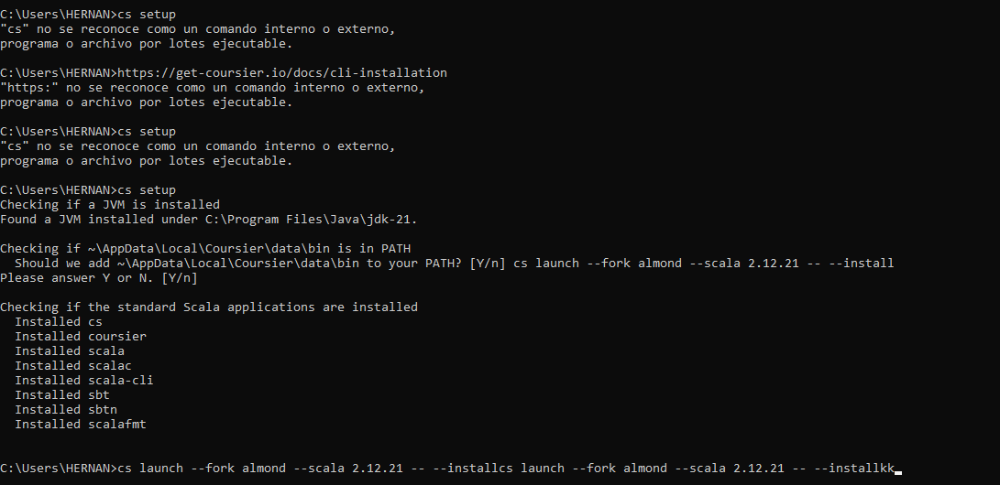
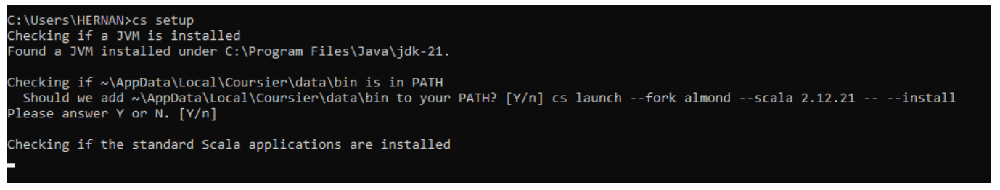
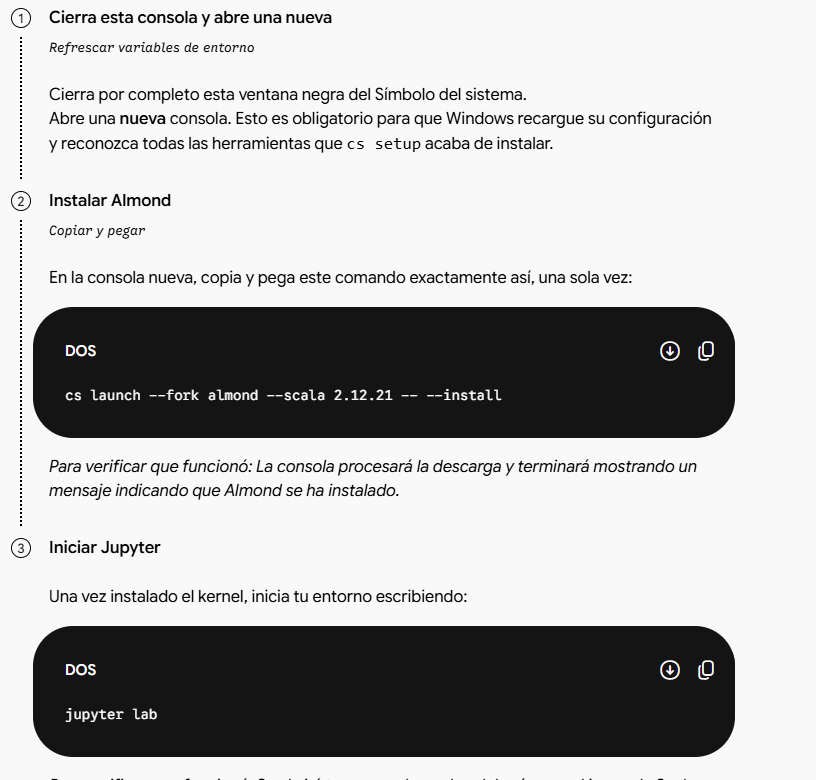
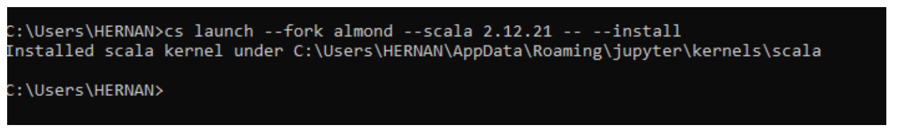
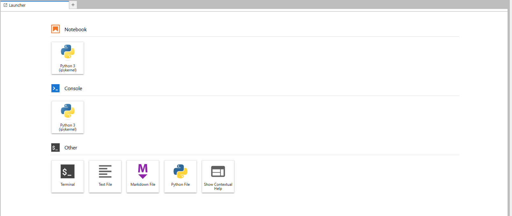
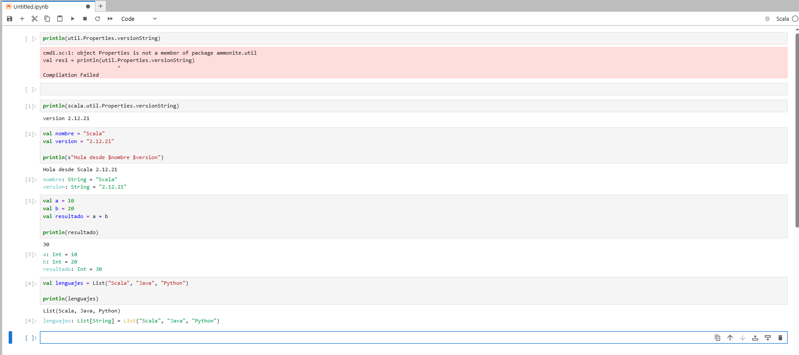

# Entorno 1.1 — JupyterLab + Almond Kernel + Scala 2.12.21

## Objetivo
Preparar un entorno interactivo basado en JupyterLab que permita crear notebooks y ejecutar código utilizando Scala 2.12.21 mediante el Almond Kernel.

## 1. Requisitos e Instalación

Para habilitar el soporte de Scala, primero verifiqué las rutas de entorno y procedí a instalar Coursier como gestor de dependencias de Scala.

A continuación, realicé la configuración del path y la verificación de que el entorno reconocía correctamente las herramientas instaladas.

## 2. Instalación de Jupyter y Almond Kernel

Descargué e instalé Jupyter en el sistema para poder utilizar la interfaz interactiva.

Tras instalar JupyterLab, procedí a leer las instrucciones oficiales y ejecuté el comando necesario para instalar el kernel de Almond vinculado a Scala 2.12.21.

El proceso finalizó correctamente, registrando el kernel de Scala en el entorno local de Jupyter.

## 3. Verificación del Entorno

Al iniciar JupyterLab de forma predeterminada (antes de la correcta integración), el Launcher no mostraba opciones de Scala.

Una vez completada la instalación de Almond y reiniciado el entorno, el Launcher detectó y mostró correctamente la opción para crear Notebooks de Scala.

## 4. Ejecución de Código

Para finalizar, creé un Notebook utilizando el kernel de Scala 2.12.21 y ejecuté bloques de código con declaraciones de variables, operaciones numéricas e impresión por pantalla para verificar su funcionamiento.

