# Entorno 1.2 — Visual Studio Code + Metals + sbt + Scala 2.12.21

## Objetivo
Preparar un entorno de desarrollo basado en Visual Studio Code, utilizando la extensión Metals y sbt.

## 1. Verificación de Versiones y Java

Comencé verificando la versión actual de Visual Studio Code instalada en mi sistema operativo.

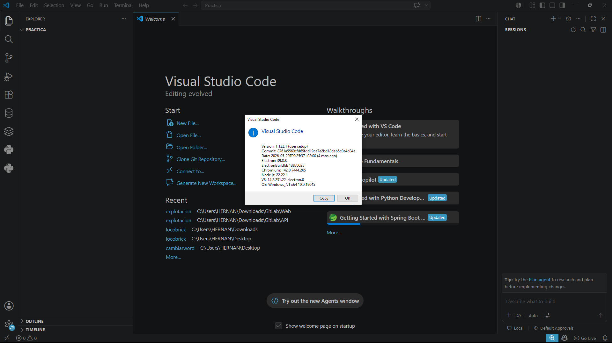

Al comprobar la versión de Java en el sistema, detecté que la versión inicial por defecto era la 21, lo cual podía generar problemas de compatibilidad.

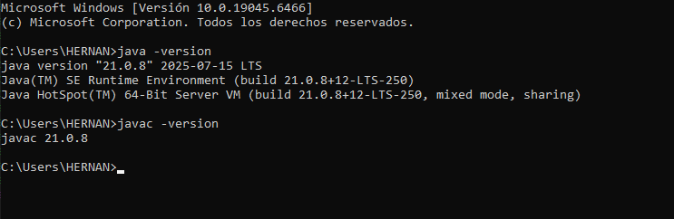

Utilizando Coursier, forcé la instalación y el uso de JDK 17.

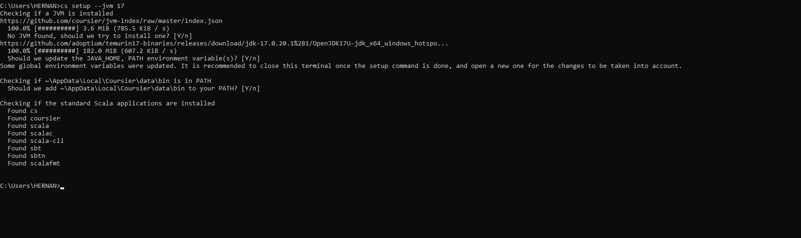

Posteriormente, verifiqué que el cambio se había aplicado correctamente y el entorno ya apuntaba a Java 17.

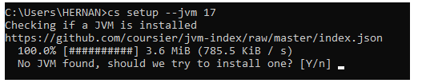

## 2. Instalación de la Extensión Metals

Desde la sección de extensiones de Visual Studio Code busqué la extensión oficial de Scala (Metals).

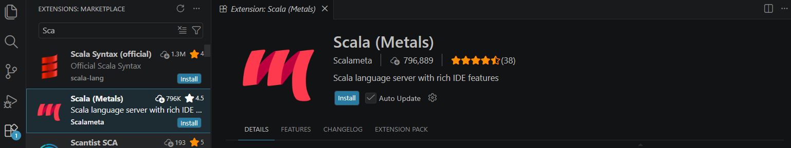

Procedí a instalarla para habilitar las funcionalidades de autocompletado y validación de código.

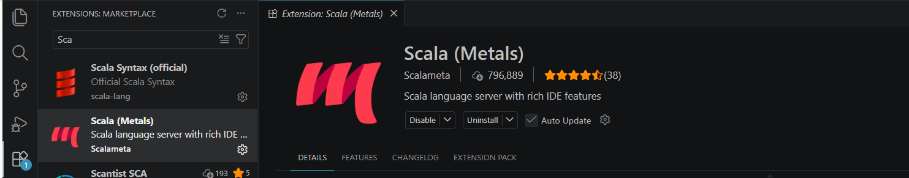

## 3. Configuración del Proyecto y sbt

Para inicializar el entorno, definí las dependencias en el archivo `build.sbt`, marcando explícitamente el uso de Scala 2.12.21.

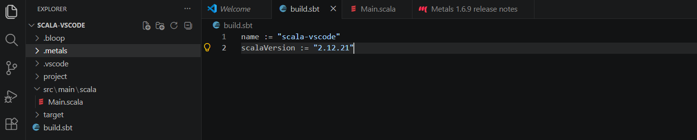

Creé la estructura de carpetas estándar (`src/main/scala`) y añadí el archivo principal del programa.

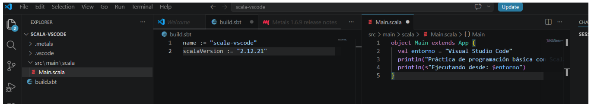

En el archivo `Main.scala`, redacté el código básico para realizar la prueba de ejecución.

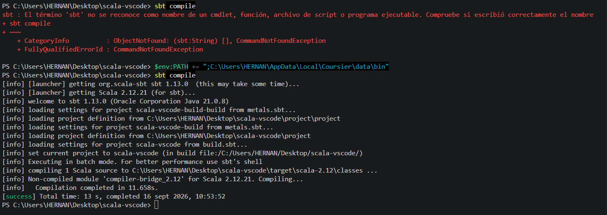

## 4. Resolución de problemas y Ejecución

Al intentar ejecutar `sbt`, me encontré con problemas de reconocimiento de comandos. Tras revisar la configuración, corregí las variables de entorno añadiendo la ruta correcta al PATH y realicé una prueba verificando sbt.

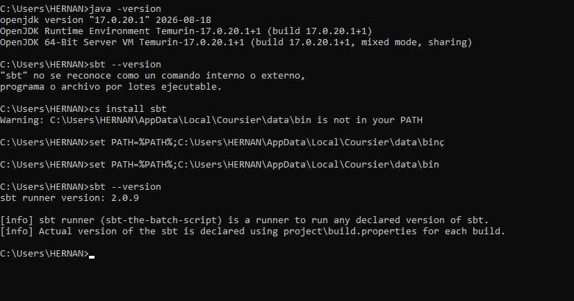

Finalmente, ejecuté los comandos `sbt compile` y `sbt run` en la terminal integrada de VS Code, compilando y mostrando los resultados correctamente.

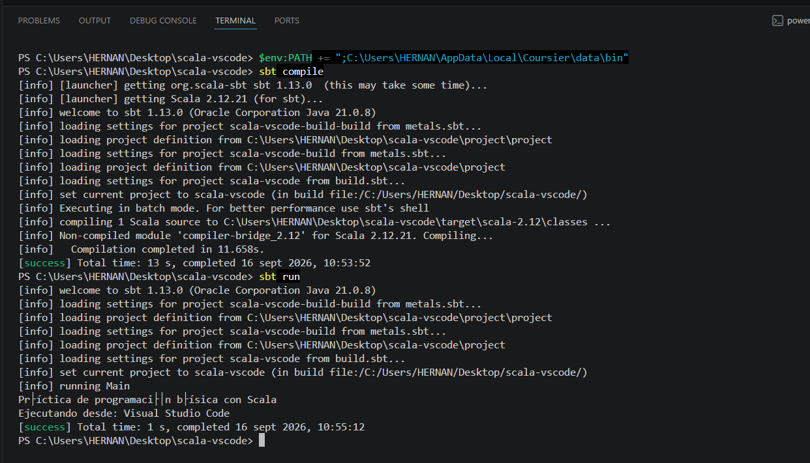
