# Entorno 1.3 — IntelliJ IDEA Community + sbt + Scala 2.12.21

## Objetivo
Preparar un entorno de desarrollo utilizando IntelliJ IDEA Community Edition, configurando el soporte para Scala mediante el plugin oficial.

## 1. Instalación del IDE y Plugin

Comencé descargando la versión Community de IntelliJ IDEA desde la base de conocimientos oficial de JetBrains.

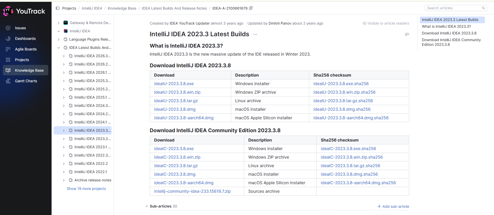

Procedí con la instalación del software en Windows 11.

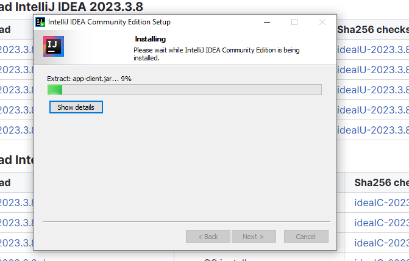

Una vez iniciado el IDE, en la pantalla de bienvenida accedí a la sección de Marketplace y busqué el plugin de Scala.

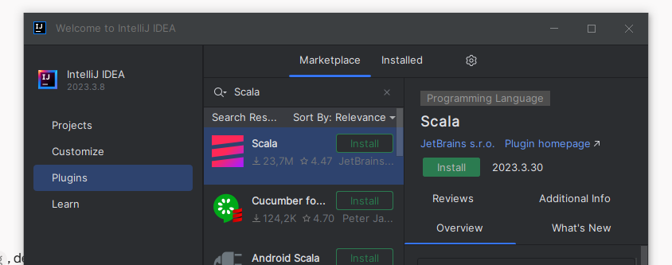

Instalé el plugin exitosamente para habilitar el soporte completo del lenguaje en el editor.

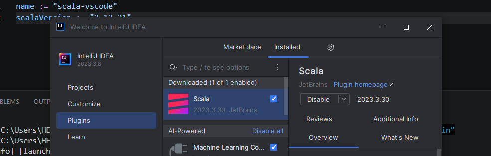

## 2. Creación del Proyecto

Creé un nuevo proyecto y en la configuración inicial seleccioné `sbt` como sistema de construcción (Build system).

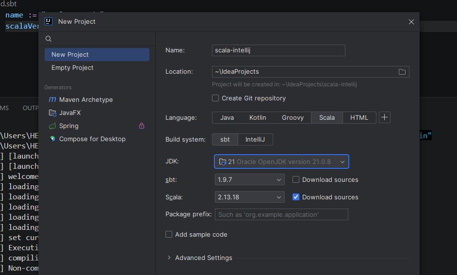

Como parte de la configuración, indiqué al IDE que descargara e integrara automáticamente Microsoft OpenJDK 17.

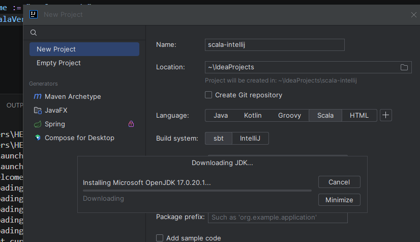

Una vez cargado el proyecto, generé la estructura de directorios y redacté el código de validación en `Main.scala`.

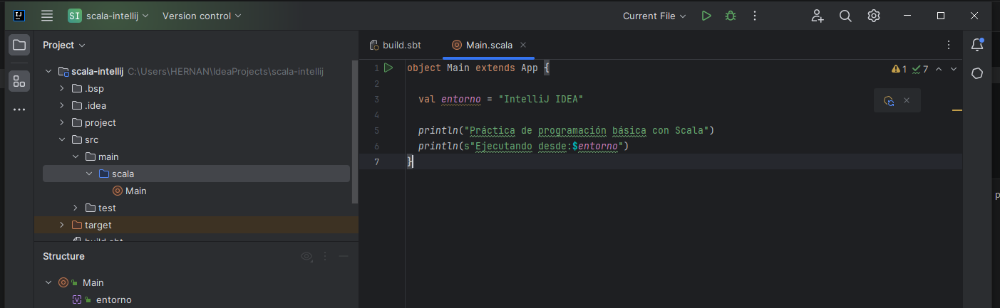

## 3. Resolución de Incidencias y Ejecución

Inicialmente, intenté ejecutar `sbt` utilizando la terminal de PowerShell local integrada en el IDE, pero el comando no fue reconocido por el sistema debido a la falta de variables de entorno.

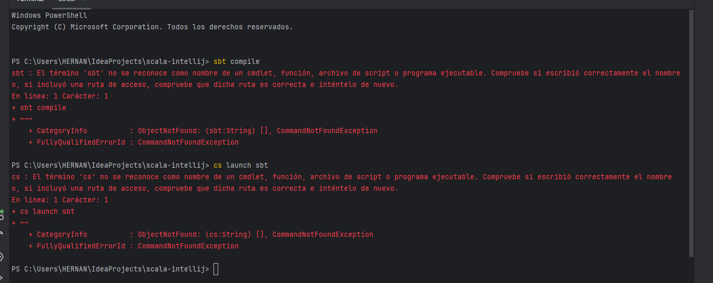

Para solucionarlo, recurrí a la consola sbt interactiva (sbt shell) nativa de IntelliJ. Primero, probé a lanzar la consola interactiva y ejecutar código directamente.

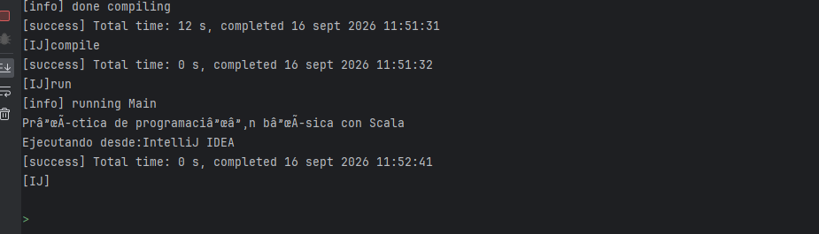

Tras comprobar que funcionaba, ejecuté el comando `compile` dentro del entorno interactivo de sbt, logrando una compilación exitosa.

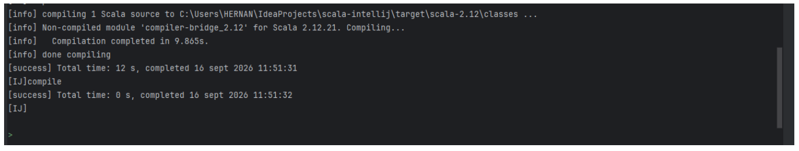

Finalmente, también verifiqué el proceso usando los botones gráficos del IDE. Observé la salida de construcción del proyecto (`Build Output`).

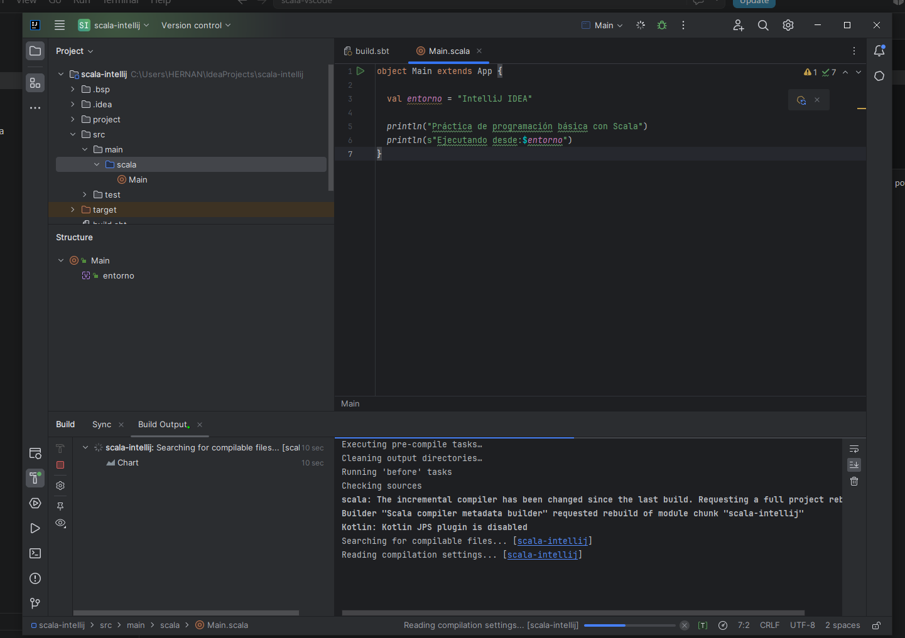

El código se ejecutó con éxito mostrando los resultados por consola y devolviendo un código de salida 0.

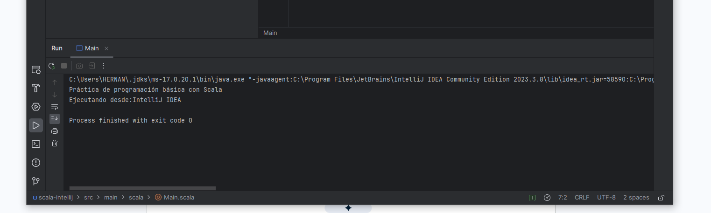
